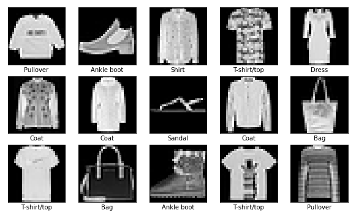

# Numerical Methods: "Different Dimensionality Reduction Techniques" Individual Project
## 2022, 1st semester



## Local Setup

1. Create an empty git repo and clone this project
```
git init
git remote add origin <new-git-url>
```

2. Download the pybind` and `eigen` repos as submodules
```
git submodule init
git submodule add https://github.com/eigenteam/eigen-git-mirror
git submodule add https://github.com/pybind/pybind11
git mv eigen-git-mirror eigen
# We choose the versions of eigen and pybind
cd pybind11/ && git checkout v2.2.4 && cd ..
cd eigen && git checkout 3.3.7 && cd ..
```

3. Install requirements (*Previously, activate the virtual environment in your PC. See below.*)
```
pip install -r requirements.txt
```

4. Decompress data
```
cd data && gunzip *.gz && cd ..
```

5. Run Jupyter
```
jupyter lab
```

That's it!

## Python's virtual environment creation

### With Python3 (this one worked best for me)
```
python3 -m venv your-project-name
source your-project-name/bin/activate
```

### With pyenv
```
curl https://pyenv.run | bash
```

Then, it is suggested to add some code lines into the basrch. After that, **RESTART THE SHELL** and add the following code...
```
pyenv install 3.6.5
pyenv global 3.6.5
pyenv virtualenv 3.6.5 your-project-name
```

On the project's directory:
```
pyenv activate your-project-name
```

### With Conda
```
conda create --name your-project-name python=3.6.5
conda activate your-project-name
```

## Dependencies installment
```
pip install -r requirements.txt
```

## How to run Jupyter Notebooks
### 1st way
```
cd notebooks
jupyter lab
```

### 2nd Way
```
jupyter notebook
```

## Compilation
Execute the first cell of the `knn.ipynb` notebook. If this doesn't work, folow the next steps:

- Compile C++ code on a Python module
```
mkdir build
cd build
rm -rf *
cmake -DPYTHON_EXECUTABLE="$(which python)" -DCMAKE_BUILD_TYPE=Release ..
```
- When executing the following command, the project gets compiled and the library is installed in the `notebooks` directory.
```
make install
```

## Overview
This project has the purpouse of studying the differences and similarities between various "Dimensionality Reduction" techniques. It was of interest to study how efficient this techniques were with the company of a "Classifier". The techniques that were treated in this experiment were: 
- PCA (Principal Component Analysis)
- t-SNE (t-distributed Stochastic Neighbor Embedding)
- UMAP (Unifold Manifold Approximation and Projection)
and the classifier was
- kNN (k-Nearest Neighbors).

The dataset provided for this project was the **Fashion MNIST**. It can be found on [Kaggle](https://www.kaggle.com/datasets/zalando-research/fashionmnist). The data was selected utilising the K-Fold Cross Validation technique. That way, a representative portion of the whole data sample will be selected.

The goal was to observe and compare the accuracy of the predictions, and the execution time, of every technique. With, or without the pressence of a classifier. 

### Project's directories and files
In `notebooks/` we can find every experimentation that was done for the project.

In `enunciado.md` there are the tasks that were completed.

Finally, in `InformeMallol.pdf` there's the final essay.

### Users should be able to
- Run every Notebook in the project.
- Read the essay and compare my conclusions with theirs.

### Built with
- Python
- Jupyter Notebooks
- Principally, the SKLEARN library.
- Fashion MNIST dataset

### What I learnt
- How to compare and experiment with different dimensionality reduction techniques.
- Get pros and cons of different techniques. Try to think the best use case scenario for every one of them.
- Manipulate a really big abd complete dataset by taking small to medium sized representative samples.
- Get the performance and time execution of multiple running tests.
